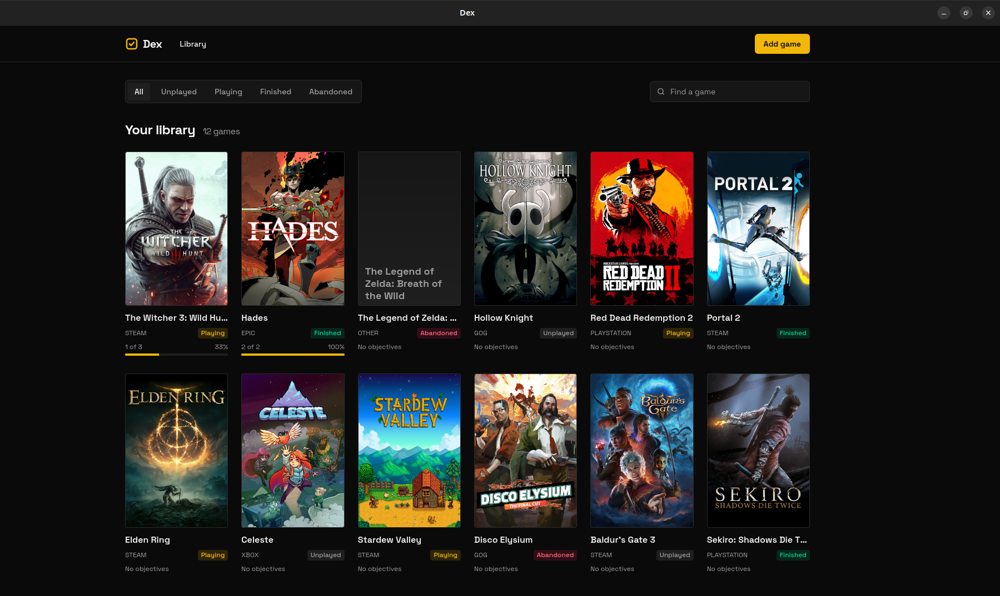
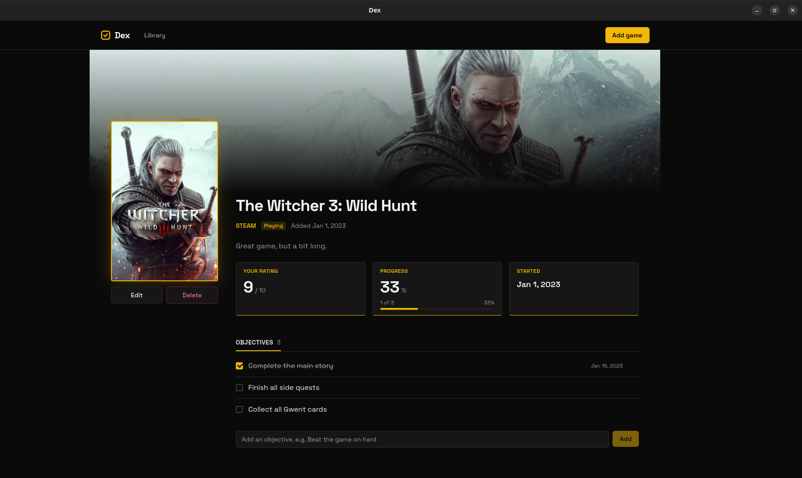

# Dex

A desktop app for managing your game backlog. Record the games you own, track whether each one is unplayed, in progress, finished or abandoned, rate and take notes on the ones you've played, and keep a checklist of personal objectives per game. Ticking objectives off updates the game's completion progress, so you can see at a glance how close each game is to done.

Built with React and TypeScript, packaged as a desktop application with Tauri 2. This is the frontend capstone of a training programme; a C# (ASP.NET Core) backend capstone will implement the API that the mocked service layer currently stands in for.

## Screenshots

| Library | Game detail |
| --- | --- |
|  |  |

## Features

- **Library** of every game with cover art, platform, status badge and a progress bar. Keyword search on the title and a status filter (Unplayed, Playing, Finished, Abandoned).
- **Game detail** with hero artwork, rating, notes, dates, and the full objective checklist. Add, tick, untick and remove objectives in place.
- **Add and edit** a game: title, platform (Steam, Epic, GOG, Xbox, PlayStation, Other), status, rating out of 10, notes, and cover / background image URLs. Rating is only available once a game is no longer Unplayed and is cleared if it goes back.
- **Progress** is derived from objectives (ticked / total) and is identical on the Library and the detail page. A game with no objectives shows "No objectives", not 0 %.
- **Guard rails** from the spec: finishing a game with unticked objectives warns but doesn't block; deleting a game requires confirmation and states that its objectives go with it.
- **Every screen** handles loading, empty and error states, including a 404 treatment for games that no longer exist.
- **Accessible by design**: native radio-group filters with arrow-key navigation, a live region announcing result counts, labelled controls throughout, a focus-trapping `<dialog>`, visible focus rings, and `prefers-reduced-motion` support. See [Accessibility](#accessibility).

## Getting started

### Prerequisites

- [Node.js](https://nodejs.org/) 20 or later and [pnpm](https://pnpm.io/)
- [Rust](https://www.rust-lang.org/tools/install) and the [Tauri 2 system dependencies](https://v2.tauri.app/start/prerequisites/) for your OS

### Run in development

```bash
git clone https://github.com/bienvenudev/dex-game-backlog.git
cd dex-game-backlog
pnpm install
cp .env.example .env
pnpm tauri dev
```

The app opens in a native window. Vite also serves it at <http://localhost:1420>, which is handy for browser devtools and the address bar.

All data is mocked in the browser with [Mock Service Worker](https://mswjs.io/). Every request goes through a real `fetch` and is intercepted by a service worker that simulates the backend, including a short artificial delay and the spec's validation rules (duplicate titles, invalid ratings, 404s). Data lives in memory and resets on reload.

> **Linux + VS Code snap:** the snap injects GTK paths that break Tauri's window (`symbol lookup error ... GLIBC_PRIVATE`). Run `pnpm tauri dev` from a regular terminal, or clear `GTK_PATH`, `GTK_EXE_PREFIX`, `GIO_MODULE_DIR`, `GSETTINGS_SCHEMA_DIR` and `LOCPATH` in VS Code's `terminal.integrated.env.linux`.

### Other commands

| Command | What it does |
| --- | --- |
| `pnpm dev` | Vite dev server only, no native window |
| `pnpm typecheck` | `tsc --noEmit` |
| `pnpm lint` | ESLint (TypeScript, React hooks, TanStack Query rules) |
| `pnpm build` | Type-check and build the frontend to `dist/` |
| `pnpm tauri build` | Produce a native installer for the current OS |

### Configuration

`.env` holds a single variable:

```dotenv
VITE_API_BASE_URL=/api
```

`/api` keeps requests on the app's own origin so the mock service worker can intercept them. When the real backend exists, point this at it (for example `http://localhost:5000/api`) and the mocks are bypassed. Nothing else changes: components never see a URL.

## Architecture

```text
src/
├── types/        Domain types. GameSummary (list) vs GameDetail (objectives + progress).
├── services/     http.ts: fetch wrapper, base URL, ApiError with status.
│                 games.ts, objectives.ts: one function per endpoint.
├── mocks/        MSW handlers + in-memory data. Mirror the backend routes and rules.
├── hooks/        useDebounce.
├── components/   GameCard, GameForm, ProgressBar, StatusBadge, ConfirmDialog, ...
├── pages/        One component per route.
└── routes/       Hash router and the AppLayout shell.
```

**Data flow.** A page calls a service function (`getGames(filters)`), never `fetch`. The service builds the URL and returns a typed promise. [TanStack Query](https://tanstack.com/query) owns caching: reads are `useQuery` keyed like `['games', filters]` or `['games', id]`; writes are `useMutation` followed by `invalidateQueries({ queryKey: ['games'] })`, whose prefix match refreshes both the list and every detail page. In development, MSW answers the requests from an in-memory store shaped like the backend's tables and computes progress server-side, so the UI never calculates it.

**Why hash routing.** Tauri serves the packaged app from a custom protocol rather than a web server, so a reload on a nested path may not resolve to `index.html`. Hash URLs sidestep that. Nobody sees the URL bar in a desktop app.

**Styling.** Tailwind CSS v4 with a small `@theme` block in `src/index.css`: near-black chrome, one gold accent, Space Grotesk self-hosted. Cover art is the only saturated thing on screen. The visual direction is inspired by [play-this.com](https://www.play-this.com): patterns, not assets.

Cover and background art are loaded from Steam's public CDN by app id. It is promotional artwork: fine for a training project, not for a shipped product.

### Mocked API

The mock handlers implement the subset of the planned backend that the UI needs:

| Method | Route | Notes |
| --- | --- | --- |
| `GET` | `/api/games?search=&status=` | Library list with progress |
| `POST` | `/api/games` | 400 on validation, 409 on duplicate title + platform |
| `GET` | `/api/games/:id` | Detail with ordered objectives and progress; 404 if missing |
| `PUT` | `/api/games/:id` | Clears rating when status returns to Unplayed |
| `DELETE` | `/api/games/:id` | Cascades to objectives; 204 |
| `POST` | `/api/games/:id/objectives` | 400 on empty label, 409 on duplicate label |
| `DELETE` | `/api/games/:id/objectives/:oid` | 204 |
| `PATCH` | `/api/games/:id/objectives/:oid/complete` | Sets `completedAt` |
| `PATCH` | `/api/games/:id/objectives/:oid/reopen` | Clears `completedAt` |

## Accessibility

Accessibility was a stated goal, not a linter pass. Highlights:

- Native elements first: `<button>`, `<label>`, `<dialog>`, `<fieldset>` with radios. ARIA only fills gaps.
- The status filter is a radio group: one Tab stop, arrow keys move and select, position announced.
- The result count is an `aria-live="polite"` region so filter changes are announced.
- Icon-only controls carry `aria-label`; decorative artwork is `aria-hidden`.
- Progress bars expose `aria-valuetext` ("1 of 3 objectives"); warnings and errors are `role="alert"`.
- The confirm dialog uses `showModal()` for a focus trap, closes on Escape and backdrop click, and is labelled by its heading.
- Gold `:focus-visible` outlines everywhere; transitions disabled under `prefers-reduced-motion`.

Known, deliberate limitations and the reasoning behind each choice are documented in [`docs/decisions.md`](docs/decisions.md).

## Project notes

- [`docs/decisions.md`](docs/decisions.md): design decisions and their tradeoffs, including accessibility choices and known limitations.
- [`docs/learning-notes.md`](docs/learning-notes.md): longer explanations of the concepts behind those decisions, written while learning them.
- [`CLAUDE.md`](CLAUDE.md): the working agreement used with an AI assistant during this project, kept in the repo so the process is transparent.

## Roadmap

- **Backend capstone**: ASP.NET Core + PostgreSQL implementing this API contract, with authentication, status history, and a dashboard summary.
- Swap `VITE_API_BASE_URL` to the real API and delete `src/mocks/`.
- Objective reordering, dashboard page, and the remaining list filters (platform, rating range, sort).
